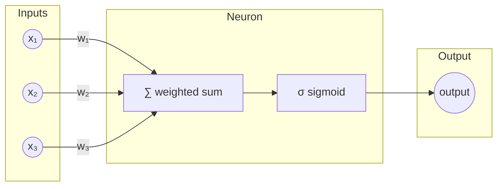

# Tiny Neural Network

A simple neural network implementation for learning basic patterns in Python.

## Overview

This project implements a **perceptron** — the simplest form of a neural network, invented by Frank Rosenblatt in 1958. It uses sigmoid activation and backpropagation to learn and classify binary input patterns. This is the fundamental building block upon which all modern deep learning is built.

## How It Works



### Process

1. **Forward Pass**: Each input is multiplied by its weight, summed together, and passed through the sigmoid function
2. **Error Calculation**: Compare the prediction to the expected output
3. **Backpropagation**: Adjust weights based on error × input × sigmoid gradient
4. **Repeat**: Train over many iterations until weights converge

## Features

- **Sigmoid activation function** - Maps outputs to values between 0 and 1
- **Backpropagation training** - Adjusts weights based on prediction errors
- **Simple API** - Easy-to-understand `think()` and `train()` methods

## Usage

```python
from neural_network import NeuralNetwork, TRAINING_SET_DATA

# Create a neural network
nn = NeuralNetwork()

# Train the network
nn.train(TRAINING_SET_DATA, number_of_iterations=10000)

# Make a prediction
result = nn.think([1, 0, 0])
print(result)
```

You can also run the module directly to see a demo:

```bash
python neural_network.py
```

## Training Data

The network comes with a sample training set that learns to recognize when the first input is 1:

| Input 1 | Input 2 | Input 3 | Output |
|---------|---------|---------|--------|
| 0       | 0       | 1       | 0      |
| 1       | 1       | 1       | 1      |
| 1       | 0       | 1       | 1      |
| 0       | 1       | 1       | 0      |

## Requirements

- Python 3.x
- No external dependencies (uses only `math` and `random` from the standard library)

## Limitations

This is an educational implementation with intentional simplifications:

| Limitation | Real-World Solution |
|------------|---------------------|
| Single layer | Multi-layer networks (deep learning) |
| No bias term | Add bias to shift activation threshold |
| No learning rate | Control how fast weights change |
| No hidden layers | Required for complex patterns like XOR |
| No batching | Mini-batch gradient descent for efficiency |

## License

MIT